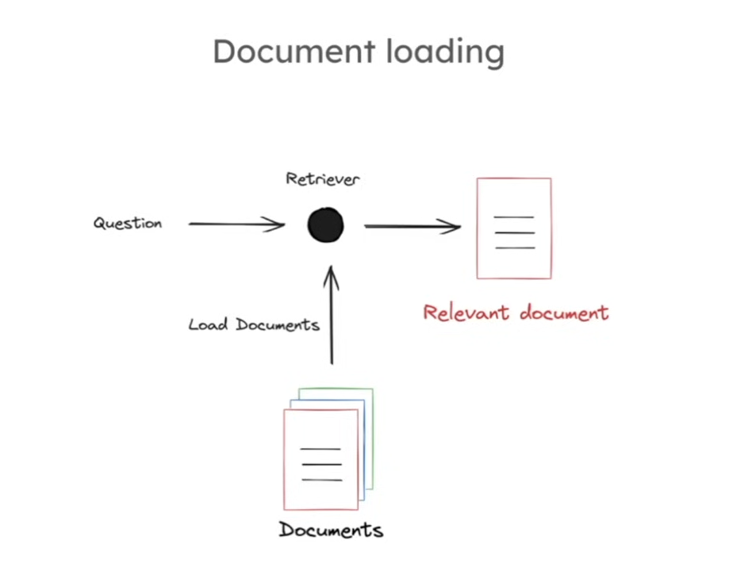
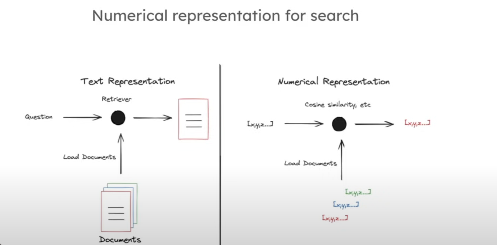

# Indexing Documentation

## 1. RAG System Overview

This diagram illustrates the complete RAG (Retrieval-Augmented Generation) system workflow. The process consists of three main stages:

- **Indexing**: Documents are processed and stored in an index
- **Retrieval**: When a question is asked, relevant documents are retrieved from the index
- **Generation**: The retrieved documents are fed into a context window for answer generation

## 2. Document Loading Process

This diagram shows the document loading process in detail. The workflow includes:

- A question is received by the retriever
- Documents are loaded from storage
- The retriever processes the documents to identify relevant content
- Relevant documents are returned for further processing

## 3. Numerical Representation for Search

This diagram compares text representation versus numerical representation for search:

- **Text Representation**: Uses traditional text-based retrieval methods
- **Numerical Representation**: Converts text documents into numerical vectors (embeddings) for similarity calculation
- Documents are transformed into vectors like [x, y, z] for efficient similarity search using techniques like cosine similarity

