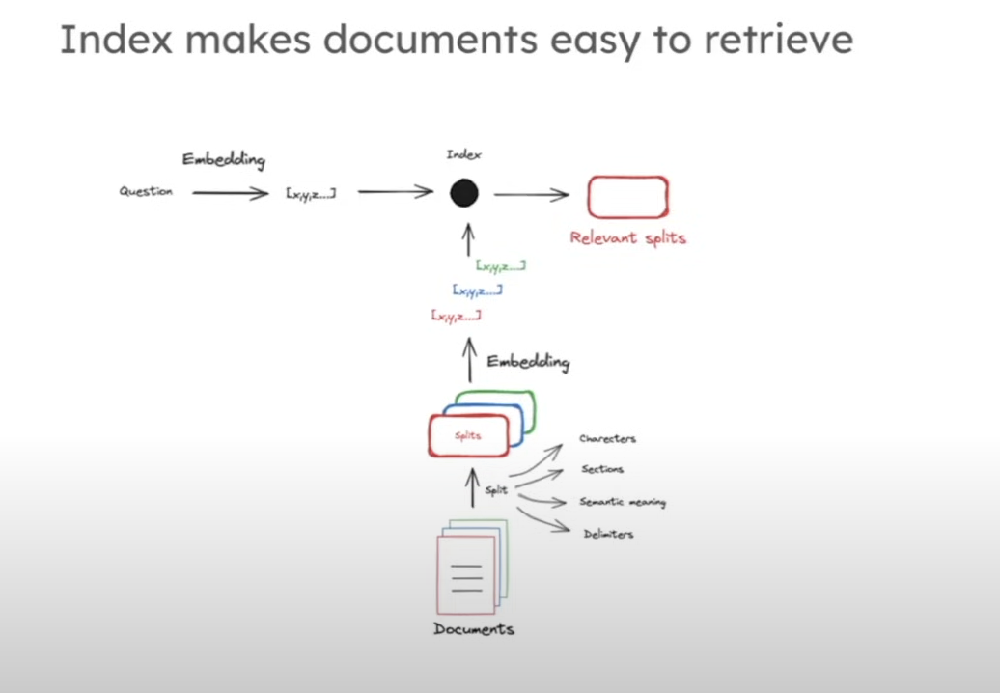
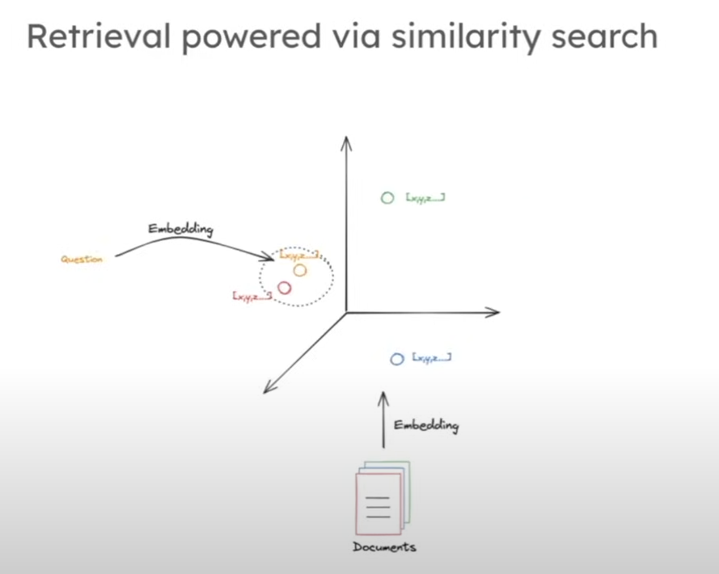
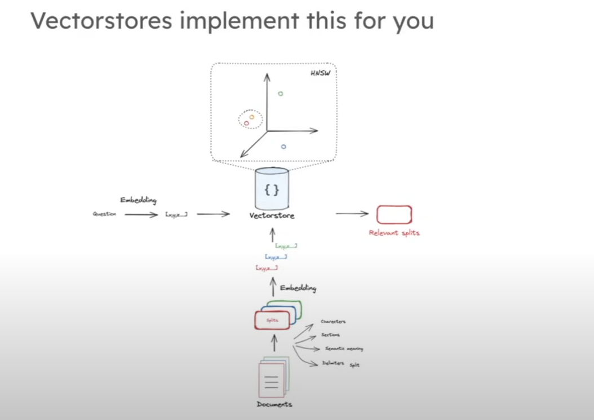
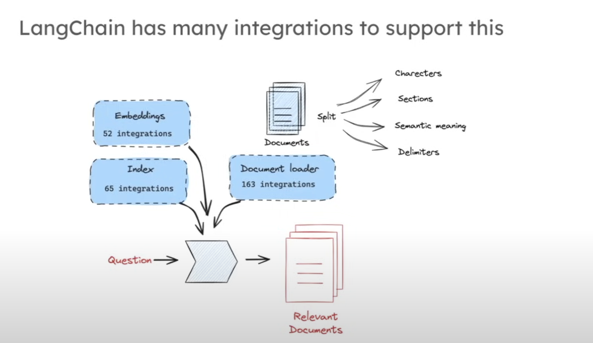

# Retrieval Documentation

## 4. Retrieval Process Overview

This diagram illustrates the fundamental retrieval process in RAG systems.

## 5. Query Processing and Document Matching

This diagram shows how queries are processed and matched with documents in the retrieval phase.

## 6. Similarity Search Techniques

This diagram demonstrates various similarity search techniques used in retrieval.

## 7. Retrieval Optimization Strategies

This diagram presents optimization strategies for improving retrieval performance.

